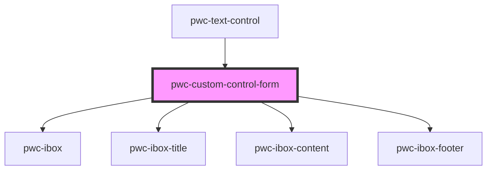

# pwc-custom-control-form

<!-- Auto Generated Below -->

## Properties

| Property | Attribute | Description | Type  | Default     |
| -------- | --------- | ----------- | ----- | ----------- |
| `form`   | `form`    |             | `any` | `undefined` |
| `shape`  | `shape`   |             | `any` | `undefined` |

## Events

| Event           | Description | Type               |
| --------------- | ----------- | ------------------ |
| `formCanceled`  |             | `CustomEvent<any>` |
| `formSubmitted` |             | `CustomEvent<any>` |

## Dependencies

### Used by

 - [pwc-text-control](../../../../pwc-custom-controls/text-control)

### Depends on

- pwc-ibox
- pwc-ibox-title
- pwc-ibox-content
- pwc-ibox-footer

### Graph

----------------------------------------------

*Built with [StencilJS](https://stenciljs.com/)*
