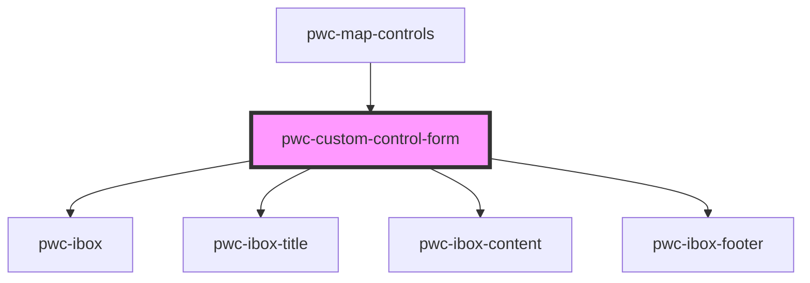

# pwc-custom-control-form

<!-- Auto Generated Below -->

## Properties

| Property | Attribute | Description | Type  | Default     |
| -------- | --------- | ----------- | ----- | ----------- |
| `form`   | `form`    |             | `any` | `undefined` |

## Events

| Event         | Description | Type               |
| ------------- | ----------- | ------------------ |
| `formActions` |             | `CustomEvent<any>` |

## Methods

### `initialize(shape: any) => Promise<void>`

#### Returns

Type: `Promise<void>`

## Dependencies

### Used by

 - [pwc-map-controls](../..)

### Depends on

- pwc-ibox
- pwc-ibox-title
- pwc-ibox-content
- pwc-ibox-footer

### Graph

----------------------------------------------

*Built with [StencilJS](https://stenciljs.com/)*
