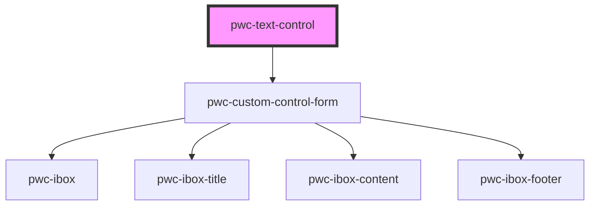

# pwc-text-control

<!-- Auto Generated Below -->

## Properties

| Property | Attribute | Description | Type  | Default     |
| -------- | --------- | ----------- | ----- | ----------- |
| `form`   | `form`    |             | `any` | `undefined` |
| `map`    | `map`     |             | `any` | `undefined` |
| `shape`  | `shape`   |             | `any` | `undefined` |

## Events

| Event  | Description | Type               |
| ------ | ----------- | ------------------ |
| `save` |             | `CustomEvent<any>` |

## Dependencies

### Depends on

- [pwc-custom-control-form](../../pwc-custom-control-form)

### Graph

----------------------------------------------

*Built with [StencilJS](https://stenciljs.com/)*
