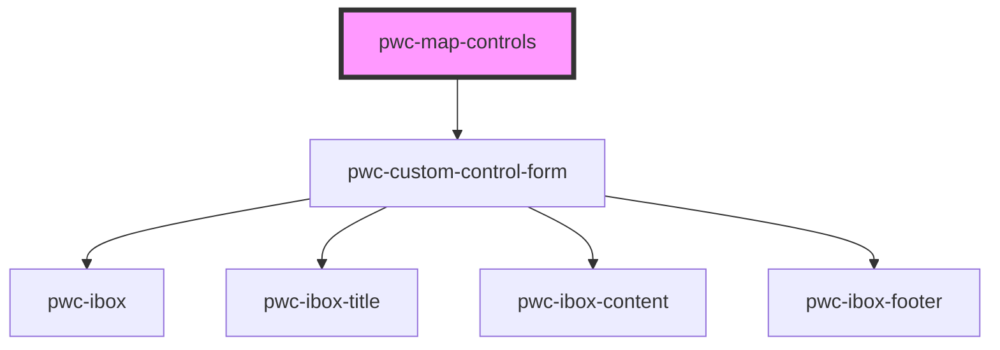

# pwc-map-controls

<!-- Auto Generated Below -->

## Properties

| Property | Attribute | Description | Type                               | Default     |
| -------- | --------- | ----------- | ---------------------------------- | ----------- |
| `config` | --        |             | `{ map: Map; controls?: Object; }` | `undefined` |

## Events

| Event     | Description | Type               |
| --------- | ----------- | ------------------ |
| `actions` |             | `CustomEvent<any>` |

## Methods

### `getControls() => Promise<any>`

#### Returns

Type: `Promise<any>`

### `initialize(config: { map: L.Map; controls?: {}; }, geometry: any) => Promise<void>`

#### Returns

Type: `Promise<void>`

## Dependencies

### Depends on

- [pwc-custom-control-form](components/pwc-custom-control-form)

### Graph

----------------------------------------------

*Built with [StencilJS](https://stenciljs.com/)*
